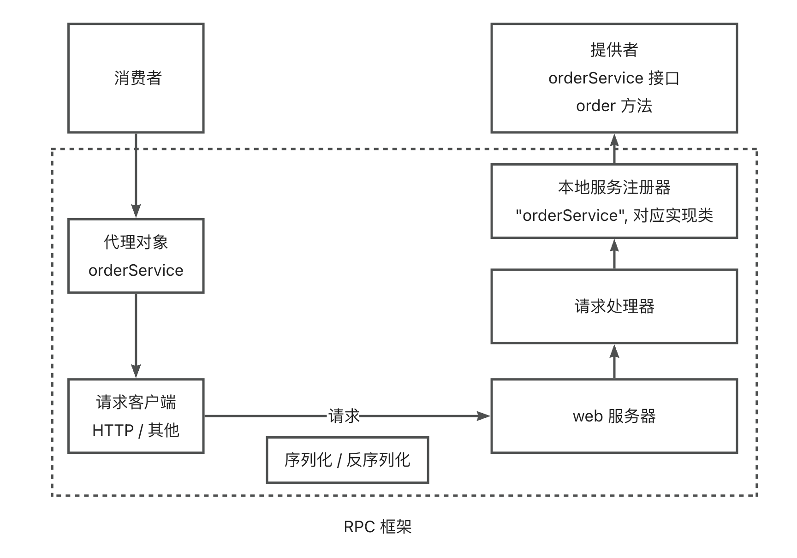
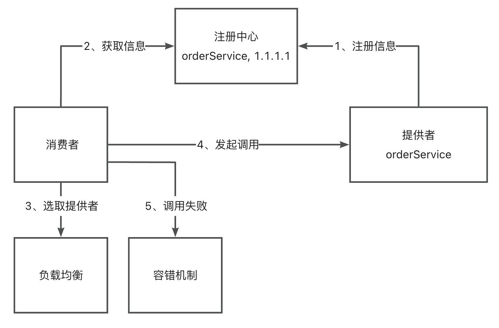
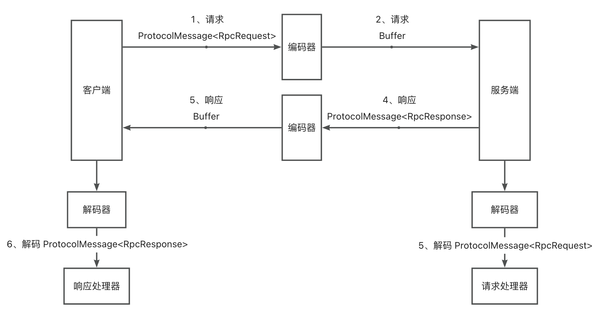

# yuan-rpc - 基于 Vert.x 的高性能 RPC 框架

---

## 项目介绍

参考 Dubbo 开源项目自主设计，基于 Java + Etcd + vert.x + 自定义协议实现的高性能 RPC 框架。开发者只需引入 Spring Boot Starter，通过注解和配置文件即可快速使用框架，可以像调用本地方法一样轻松调用远程服务；
还支持 SPI 机制动态拓展序列化器、负载均衡器、重试和容错策略等。

## 核心模块设计

1. 消费者代理模块：基于代理模式实现，在服务消费者对服务提供者进行远程调用时，不需要考虑是如何实现调用的，直接调用写好的服务接口即可。
2. 注册中心：基于 Etcd 实现注册中心，服务提供者会将自己的地址、接口、分组等详细信息都上报到注册中心模块，并且当服务上线、下线的时候通知到注册中心； 
服务调用方就可以从注册中心动态获取调用信息，而不用在代码内硬编码调用地址。
3. 本地服务注册器：服务提供端存储服务名称和实现类的映射关系，便于后续根据服务名获取到对应的实现类，从而通过反射完成调用。
4. 路由模块（负载均衡）：当有多个服务和服务提供者节点时，服务消费者需要确认请求哪一个服务和节点。
在路由模块中，通过实现不同算法的负载均衡器，帮助服务消费者选择一个服务节点发起调用。
5. 自定义 RPC 协议：自主实现基于 Vert.x (TCP) 和自定义请求头的网络传输协议，并自主实现了对字节数组的编码/解码器，可以完成性能更高的请求和响应。
6. 请求处理器：服务提供者在接收到请求后，可以通过请求处理器解析请求，从本地服务注册器中找到服务实现类并调用方法。
7. 重试和容错模块：在调用出错时，进行重试、降级、故障转移等操作，保障服务的可用性和稳定性。
8. 启动器模块：基于注解驱动 + Spring Boot Starter，开发者可以快速引入本 RPC 框架到项目中。

## 核心架构设计

1. 整体调用流程：

2. 注册中心的作用：

3. 自定义协议的请求响应流程：

## 主要功能

1. 基于 Vert.x 的 HTTP 服务器，使用 JDK 动态代理 + 工厂模式实现消费方调用模块，为指定服务接口类生成可发送 HTTP 请求的代理对象，实现远程方法的无感知调用。
2. 使用线程安全的 ConcurrentHashMap 存储本地服务注册信息，可以根据服务名称获取到对应实现类，并通过反射完成方法调用。
3. 为便于拓展，编写通用的序列化器接口，并基于 Java 原生的 Object 和 ByteArray 输⼊输出流实现 JdkSerializer 序列化器，使得对象能够进行网络传输。
4. 使用双检索单例模式维护全局配置对象，并通过 Hutool 的 Props 实现多环境配置文件的加载。
5. 基于 Etcd 云原生中间件实现了高可用的分布式注册中心，利用其层级结构和 Jetcd 的 KvClient 存储服务和节点信息，并支持通过 SPI 机制拓展。
6. 由于 HTTP 协议头信息较多，基于 Vert.x TCP 服务器 + 类 Dubbo 的紧凑型消息结构自实现了 RPC 协议，提升网络传输性能。
